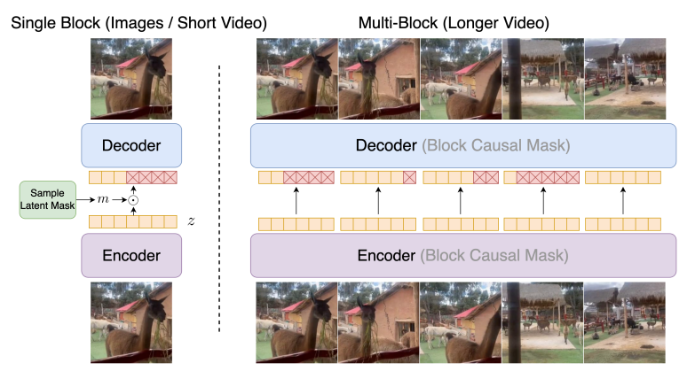

# ElasticTok: Adaptive Tokenization for Image and Video

[[Project]](https://largeworldmodel.github.io/elastictok)
[[Paper]](https://arxiv.org/abs/2410.08368)
[[Models]](https://huggingface.co/LargeWorldModel)

**ElasticTok** is an autoencoder than can adaptively tokenize image and long video to variable sequence lengths, depending on the complexity of the input data.


<div align="center">
    
</div>

Efficient video tokenization remains a key bottleneck in learning general purpose vision models that are capable of processing long video sequences. Prevailing approaches are restricted to encoding videos to a fixed number of tokens, where too few tokens will result in overly lossy encodings, and too many tokens will result in prohibitively long sequence lengths. In this work, we introduce ElasticTok, a method that conditions on prior frames to adaptively encode a frame into a variable number of tokens. To enable this in a computationally scalable way, we propose a masking technique that drops a random number of tokens at the end of each frames's token encoding. During inference, ElasticTok can dynamically allocate tokens when needed -- more complex data can leverage more tokens, while simpler data only needs a few tokens. Our empirical evaluations on images and video demonstrate the effectiveness of our approach in efficient token usage, paving the way for future development of more powerful multimodal models, world models, and agents.

## Setup

This codebase is supported on Ubuntu and has not been tested on Windows or macOS. We recommend using TPUs for training and inference, although it is also possible to use GPUs. On TPU, the code is highly optimized with Jax's Pallas and can achieve high MFUs with RingAttention at millions tokens context sizes. On GPU, the code is based on XLA and is not as optimized as it is for TPU.

Install the requirements with:
```
conda create -n elastic python=3.10
conda activate elastic
pip install -r gpu_requirements.txt
```
or set up TPU VM with:
```
sh tpu_requirements.sh
```

## Available models
We provide pretrained model checkpoints for our continuous and discrete tokenizers trained on a mix of image and video.

| Model Name            | Max Context Size | Max Video Length       | URL                                                                    |
|-----------------------|------------------|------------------------|------------------------------------------------------------------------|
| ElasticTok-VAE | 512K             | 42s (256 x 256 24 FPS) | [[Link](https://huggingface.co/LargeWorldModel/ElasticTok-VAE)] |
| ElasticTok-FSQ   | 1M               | 42s (256 x 256 24 FPS)    | [[Link](https://huggingface.co/LargeWorldModel/ElasticTok-FSQ)]   |


## Code structure
Use `scan_query_chunk_size` and `scan_key_chunk_size` to control the block size in blockwise compute of the self-attention. Use `scan_mlp_chunk_size` to control the block size in blockwise compute of the feedforward network. Use `scan_attention=True` and `scan_mlp=True` to enable/disable blockwise compute in the self-attention and feed-forward network.

You can use `mesh_dim=dp, fsdp, tp, sp` to control the degree of parallelism and RingAttention. It is a string of 4 integers separated by commas, representing the number of data parallelism, fully sharded data parallelism, tensor parallelism, and sequence parallelism.
For example, `mesh_dim='1,64,4,1'` means 1 data parallelism, 64 fully sharded data parallelism, 4 tensor parallelism, and 1 sequence parallelism. `mesh_dim='1,1,4,64'` means 1 data parallelism, 1 fully sharded data parallelism, 4 tensor parallelism, and 64 sequence parallelism for RingAttention.


## Running Models
In this section, we provide instructions on how to run each of the provided scripts. For each script, you may need to fill in your own paths and values in the variables described in the beginning of each script.

To run each of the following scripts, use `bash <script_name>.sh`:
- Training: `bash scripts/run_train.sh`
- Inference (VAE): `bash scripts/run_inference_vae.sh`
- Inference (FSQ): `bash scripts/run_inference_fsq.sh`

By default the `mesh_dim` argument puts all devices on `tp` (tensor parallelism). For longer sequences, you may want to include `sp`, which is the last dimension in the `mesh_dim`.

An example of filling out a script (`run_inference_fsq.sh`) is as follows
```bash
#! /bin/bash

export SCRIPT_DIR="$( cd -- "$( dirname -- "${BASH_SOURCE[0]}" )" &> /dev/null && pwd )"
export PROJECT_DIR="$( cd -- "$( dirname -- "$SCRIPT_DIR" )" &> /dev/null && pwd )"
cd $PROJECT_DIR
export PYTHONPATH="$PYTHONPATH:$PROJECT_DIR"

export checkpoint_path="params::/path/to/ckpt/folder/params"

python3 -u scripts/inference.py \
    --input_path='example/video.mp4' \
    --output_folder='example/outputs_fsq' \
    --max_blocks_per_chunk=4 \
    --threshold=0.003 \
    --mesh_dim='!1,1,-1,1' \
    --dtype='fp32' \
    --load_elastic_config='200m' \
    --update_elastic_config="dict(mask_mode='elastic',min_toks=256,max_toks=4096,frames_per_block=4,patch_size=(1,8,8),bottleneck_type='fsq',fsq_quant_levels=(8,8,8,5,5,5),theta=50000000,max_sequence_length=16384,use_flash_attention=True,scan_attention=True,scan_query_chunk_size=512,scan_key_chunk_size=512,remat_attention='',scan_mlp=True,scan_mlp_chunk_size=8192,remat_mlp='nothing_saveable',remat_block='',scan_layers=True)" \
    --load_checkpoint="params::$checkpoint_path"
```
where `checkpoint_path` points to the params file downloaded from HuggingFace. If you want to test your own model, you can point it directly to the `streaming_train_state` output of the train checkpointing as `trainstate_params::/path/to/ckpt/folder/streaming_train_state`.

For training, see comments in `scripts/run_train.sh`

## If you have issues

If you encounter bugs, please open a GitHub issue!

## Citation

If you use this codebase, or otherwise found our work valuable, please cite:

```
@article{yan2024elastic,
    title={ElasticTok: Adaptive Tokenization for Image and Video},
    author={Yan, Wilson and Zaharia, Matei and Mnih, Volodymyr and Abbeel, Pieter and Faust, Aleksandra and Liu, Hao},
    journal={arXiv preprint},
    year={2024},
}
```

## License

ElasticTok's code and models are released under the Apache 2.0 License. See [LICENSE](https://github.com/LargeWorldModel/ElasticTok/blob/main/LICENSE) for further details.
